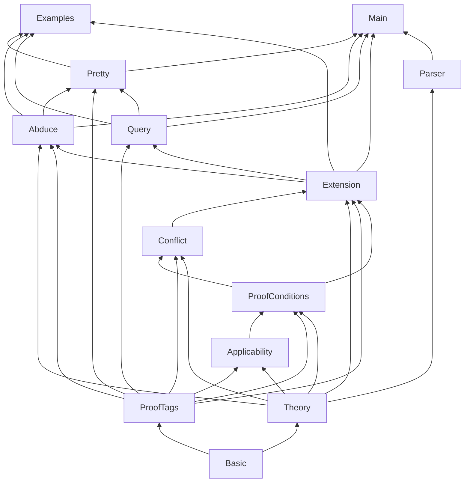

# Architecture

This document describes how the **deontic** reasoner is structured: from `.ddl` input files through proof-theoretic extension computation to CLI and JSON output.

The implementation follows the proof-theoretic account of **defeasible deontic logic** in Governatori (2018), *Defeasible Deontic Logic: An Argumentation-based Approach* (especially §3.1–§3.3 on tagged literals, proof conditions, and superiority).

## High-level flow

```
  .ddl file
      │
      ▼
  Parser.lean          ──►  Theory (facts, rules, superiority)
      │
      ▼
  Extension.lean       ──►  fixed-point Derivation (+∂ / −∂ tags)
      │                      via ProofConditions + Applicability
      ▼
  Conflict.lean        ──►  unresolved obligation deadlocks
      │
      ▼
  ProofConditions      ──►  +∂_⊥ (non-compensable violation)
      │
      ▼
  Query / Pretty       ──►  human status or JSON for tools
```

The CLI entry point is `Main.lean`, which loads a theory, calls `computeExtension`, and renders results.

## Repository layout

| Path | Role |
|------|------|
| `Deontic/Basic.lean` | Atoms, literals (`pos` / `neg`), deontic operators, `OExpr` (compensatory chains `a * b * c`) |
| `Deontic/Theory.lean` | `Rule`, `Theory`, `AtomDecl`, `ImportDecl`, namespacing + guarded merge, Herbrand base, superiority (`defeats`) |
| `Deontic/Parser.lean` | Tokeniser and parser for `.ddl` → `Theory` |
| `Deontic/ProofTags.lean` | Modalities (`C`, `O`, `P`, `Pw`, `Ps`), `TaggedLit` (carries a Hohfeldian `bearer`), `Derivation`, bearer-scoped views, `Extension` |
| `Deontic/Applicability.lean` | Body-applicable / body-p-applicable; compensatory index conditions |
| `Deontic/ProofConditions.lean` | `canDerive_*` for each modality; `canDerive_bot`; `applicableObligationRules` |
| `Deontic/Extension.lean` | Fixed-point loop over the Herbrand base |
| `Deontic/Conflict.lean` | Unresolved `O(a)` vs `O(~a)` conflicts (judge / superiority) |
| `Deontic/Abduce.lean` | Backward search: which fact configurations make a goal hold |
| `Deontic/Query.lean` | Per-atom normative status (`O`, `F`, `Ps`, `unresolved`, …) |
| `Deontic/Pretty.lean` | Text and JSON rendering |
| `Deontic/Examples.lean` | Embedded theories and `#eval` demos |
| `Main.lean` | `deontic check` / `deontic query` executable |
| `examples/*.ddl` | Sample theories (license contract, TCPC complaint, …) |

Build system: [Lake](https://github.com/leanprover/lean4) (`lakefile.lean`, `lean-toolchain`).

## Core data structures

### Theory

A **defeasible deontic theory** `D = (F, R, ≺)`:

- **Facts** `F`: ground literals that hold in the scenario (e.g. `license`, `commission`).
- **Rules** `R`: labelled rules with strength (`->`, `=>`, `~>`), family (constitutive vs prescriptive `…O`), antecedent, and conclusion (possibly a compensatory chain).
- **Superiority** `≺`: ordered pairs `(winner, loser)` — when two rules conflict, the winner defeats the loser.

### Derivation and extension

Reasoning does not output a single “true” atom set. It builds a **derivation** `P`: a set of **tagged literals**:

- `+∂_□ q` — defeasibly derive literal `q` in modality `□`
- `−∂_□ q` — defeasibly derive the strong negation of `+∂_□ q`

Modalities include constitutive `C`, obligation `O`, and several permission flavours (`Ps`, `Pw`, `P`). A deontic tag also carries an optional **bearer** (`+∂_O@Vendor q`) — see *Hohfeldian bearers* below.

An **extension** bundles:

| Field | Meaning |
|-------|---------|
| `derivation` | Final tagged literal set after fixed point |
| `hasViolation` | `+∂_⊥`: an applicable obligation is unfulfilled in the facts and not compensable |
| `unresolvedConflicts` | Applicable rules support both `O(a)` and `O(~a)` with no `≺` between them |

## Fixed-point engine (`Extension.lean`)

`computeExtension` iterates until no new tags appear:

1. For each atom in the **Herbrand base** (all atoms appearing in facts or rules).
2. For each literal polarity and modality, try to add `+∂` or `−∂` if the corresponding `canDerive_*` predicate holds given the current derivation.
3. Repeat until stable (fuel-bounded).

Proof conditions in `ProofConditions.lean` are **modular**: each `canDerive_O_pos`, `canDerive_C_pos`, etc. implements the paper’s side of the calculus for that tag. They consult:

- current derivation `P`
- rule applicability (`Applicability.lean`)
- superiority when counter-rules must be defeated or discarded

Obligations use **only** strict and defeasible rules (not defeaters `~>`) to establish `+∂_O`; defeaters block or reshape conclusions without positively entailing obligations.

## Hohfeldian bearers (directed obligations)

A duty is always *someone's* duty. A prescriptive rule may name the party that bears its obligation/permission with `@Party` on the arrow (`pay: FeesDue =>O@Customer PayFees`); the bearer rides on the **obligation**, not the atom, so the act stays a single shared, importable token while the duty is directed. The correlative right-holder (the other party) is left implicit — rights are *derivable* from `O@bearer + counterparty`, so no separate `R` modality is introduced. Bearer is **optional**: a rule written without `@` is unattributed (`bearer = none`) and a theory with no `@` reduces exactly to the original calculus.

`TaggedLit` carries the bearer (`none` for the bearer-neutral constitutive `C` and for unattributed norms). The crucial design property: **`ProofConditions.lean` is reused verbatim** — none of the published calculus is rewritten for bearers. Instead `Extension.lean` derives obligations/permissions/violations **once per bearer**, feeding each `canDerive_*` call a bearer-scoped *view* of the derivation:

- `Theory.scopedForBearer b` — the rules party `b` owns (all constitutive rules + `b`'s prescriptive rules). A counter-rule of a *different* bearer is invisible, so it cannot attack `b`'s obligation.
- `Derivation.scopeForBearer b` — the tags `b` can see (all `C` tags + `b`'s deontic tags, rebearered to `none` so the bearer-blind proof conditions read them unchanged).
- `Derivation.flattenBearers` — the bearer-neutral view the constitutive layer sees, where a deontic antecedent `O(x)` holds when *any* party is obliged `x`.

Consequences, all falling out of this scoping:

- **Cross-party coexistence:** `O@Vendor(a)` and `O@Customer(~a)` both derive — opposite duties borne by different parties are independent norms, not a deadlock.
- **Per-bearer conflict:** `Conflict.lean` flags `[JUDGE]` only when *one* party is pushed toward both `O(a)` and `O(~a)`; the report names the bearer.
- **Per-bearer violation:** `+∂_⊥` is checked in each bearer's scoped view — a violation is a specific party failing their duty.

Bilateral contracts need **no atom split**: confidentiality is one atom `Disclose` with two directed rules (`=>O@Vendor ~Disclose`, `=>O@Customer ~Disclose`), yielding distinct `Ps@Vendor`/`Ps@Customer` carve-outs. Known limits: a rule carries a *single* bearer (a chain mixing actors gets one tag), and "the non-breaching party" (a bearer bound by the antecedent) needs role variables, not yet supported — such clauses stay unattributed. See `examples/clauses/enterprise_saas_msa.ddl`.

## Applicability and compensatory chains

`Applicability.lean` encodes when a rule’s body is satisfied:

- Plain literals: membership in facts `F` or prior `+∂` / `−∂` tags.
- Deontic literals in the body: corresponding tags in `P`.
- **Compensatory** prescriptive conclusions `c1 * c2 * … * cn`: literal `cj` is only obligating if all earlier `ck` (`k < j`) are already `+∂_O` *and* violated in the facts (the “remedy after breach” pattern in the license example).

## Outcomes the tool surfaces

### Normative status (`Query.lean`)

For each queried atom, the CLI reports a summary status, in priority order:

1. `unresolved` — deadlocked obligation conflict on this atom
2. `O(a)` / `F(a)` — obligation / prohibition
3. `Ps(a)`, factual constitutive, `P(a)`, `Pw(a)`, or `unknown`

### Non-compensable violation (`+∂_⊥`)

`canDerive_bot` is true when some applicable prescriptive rule’s full conclusion chain is obligating in `P`, but at least one conclusion literal is **violated** in the facts (positive atom missing, or negative atom’s positive form present). Example: `publish` without `remove` when `r2`’s compensatory structure applies.

### Unresolved conflicts (judge)

`Conflict.lean` runs **after** the fixed point. For each atom `a`:

- Neither `+∂_O(a)` nor `+∂_O(~a)` is in the derivation.
- There are applicable obligation rules on both sides.
- Some pair `(r, s)` has **no** superiority in either direction.

The reasoner prints `[JUDGE: …]` and suggests adding `r > s` or `s > r`. This is intentional: the engine does not guess the law; a human (or downstream workflow) supplies `≺`.

## Abduction (`Abduce.lean`)

`check`/`query` run **forward** (facts → tagged literals); optional `--assume`
overlays the file's `facts:` (same tokens as `abduce`). Default output is
**per-bearer** normative status (`normativeStatusForBearer` in `Query.lean`):
for each atom, one line per party that owns a prescriptive rule concluding that
act (or a single line when only one party does). `--bearer Party` filters to one
slice; `--json` includes a `byBearer` map. `abduce` runs **backward**: given a
*goal* it returns fact configurations that make the goal hold. Goals may name a
bearer (`P@Customer(Disclose)`) or leave it aggregate (`P(Disclose)` — no party
forbids and some party permits). See the [README](../README.md#bearers-in-query--check--abduce).

It is satisfiability-flavoured but not a SAT call. The search ranges only over the **abducible** atoms — those appearing as plain literals in rule antecedents, since only those change which rules fire — trying each present (in a tested polarity) or absent; the theory's own `facts:` line is ignored, as facts are what we solve for. Each configuration is evaluated with the same `computeExtension`, and the result is the subset-**minimal** satisfying configurations (the least you must assert; every superset also works). Assumptions pin atoms beforehand, both narrowing the question and shrinking the space, which is otherwise bounded by a configuration cap.

## Atom descriptions & provenance

Atom names are opaque tokens; the same name in two theories can mean different things. `AtomDecl` (an `atom NAME: description | <prov>…` line) grounds each atom so a fact-finder — human or LLM — knows what asserting it commits to, and binds it back to its source. Descriptions are **mandatory**: `loadTheory` refuses a theory with any undescribed Herbrand atom (the `atoms` command uses a non-enforcing load so it can still inspect). Provenance (`Provenance` = `{quote?, uri?}`, at least one set) follows the description as `|`-separated `quote:`/`uri:` segments (bare text is taken as a quote). A `uri` is a relative path to an in-repo markdown source with an optional GitHub-style line selector (`sources/nda.md#L3-L6`); atom lines skip `#` comment-stripping so selectors survive. `deontic atoms` prints the dictionary and can `--resolve` a uri to the lines it points at. Descriptions and provenance are metadata — they do not affect the extension.

## Imports & namespacing

A theory can reuse another via `import <path> [as <alias>]` (imported atoms and rule labels are prefixed `alias.`, default alias = file stem) or `from <path> import *` (merged unprefixed). The pure parser only *records* `ImportDecl`s; the loader (`Main.resolveImports`) reads the referenced files relative to the importer, recursively resolves their imports, applies `Theory.namespaced` for aliased imports, and folds them in with `Theory.mergeGuarded`. The merge is **description-guarded**: two declarations of the same atom must share a description (else the atoms aren't the same thing — error), and rule labels must be unique; import cycles are detected and rejected. This keeps the grounding rule consistent — *description = an atom's contract, namespace = its identity, a merge is legal only when contracts match*. Atoms stay shared semantics; only labels are isolated. (Selective `from … import a, b` is not yet implemented.)

## Parser and `.ddl` syntax

`Parser.lean` reads line-oriented theories:

```ddl
facts: license, commission, use

r4:  commission  =>O  publish
r2:  =>O  ~publish * remove

superiority: r4 > r2, r2e > r2
```

- Comments: `# …`
- Rule arrows: `->`, `=>`, `~>`, and prescriptive variants `->O`, `=>O`, `~>O`
- Bearer (prescriptive arrows only): `=>O@Vendor`, `~>O@Customer` — names the duty-bearer (*Hohfeldian bearers* above); `@` on a constitutive arrow is an error
- Negation: `~atom`
- Compensatory chain: `lit1 * lit2 * …`
- Superiority: `r1 > r2` (comma-separated)

### Syntactic sugar (parse-time desugaring)

Three conveniences are **pure rewrites in `Parser.lean`** — they expand before
`Theory` is built, so `ProofConditions`/`Extension` (the published calculus) are
untouched. They were added to make large authored theories (see
`examples/codice_penale/`) read like the source text.

- **`oneof[a, b, c]`** in an antecedent → one rule per disjunct (`label$1`,
  `label$2`, …); several `oneof`s give the cartesian product. Author-written
  `superiority:` pairs naming an expanded label are rewritten across all
  variants. Use for "violence **or** threat" (`oneof[Violence, Threat]`).
- **Precondition block** — `<literals> {` … `}` (no keyword; a line ending in
  `{` with no arrow opens it, `}` closes it, nestable). Each rule inside gets
  the literals **prepended** to its antecedent, so a shared set of elements is
  written once. Rules that should *not* inherit them (e.g. the prohibition) stay
  outside the block.
- **`overrides X`** suffix on a rule (after the conclusion; `overrides X, Y` for
  several) → generates a **defeater** `~>O ~A`, gated on the rule's *plain-fact*
  antecedents only (deontic `O(…)` literals dropped, so it activates no later
  than the rule it overrides — sidestepping the frozen-snapshot ordering
  hazard), and makes it superior to the defeated rule(s). `X` is either a **rule
  label** (`overrides pena_624` — that rule only) or an **atom** (`overrides
  ReclusioneFurto` — every rule whose conclusion head is that atom). Effect: the
  overridden obligation becomes *not-obligated* (`P`), **not** forbidden (`F`).
  Lex specialis: `Ergastolo overrides pena_624` or `… overrides Reclusione21`.

## CLI

```bash
lake build deontic
./.lake/build/bin/deontic check  examples/ex1_license.ddl
./.lake/build/bin/deontic query examples/ex1_license.ddl publish use --json
```

| Command | Purpose |
|---------|---------|
| `check` | Per-atom **per-bearer** summary (default); `--trace` dumps all tags |
| `query` | Per-atom status by bearer; `--bearer Party` pins one party |
| `abduce` | Backward search: fact configurations that make a goal hold |
| `atoms` | Print each atom's description + provenance (`--json`, `--resolve`) |

Flags:

- `--json` — machine-readable output (`hasViolation`, `unresolvedConflicts`, per-atom `status`, `byBearer`, `tags`)
- `--trace` — show every derived tag (`query`; also `check`)
- `--why` — proof certificate (`query`): per atom and bearer, the *applicable* rules concluding it (`forO`) and its complement (`againstO`), each annotated with the superiority defeats; computed by `whyForBearer` (`Query.lean`) on the same bearer-scoped views the proof conditions consulted, so it shows exactly what decided the outcome. Combine with `--json` for pipelines.
- `--bearer Party` — report only that bearer (`query` / `check`)
- Abduction goals: `O@Party(a)` / `P@Customer(a)` for directed search; bare `O(a)` / `P(a)` aggregate over bearers

## Module dependency graph



## Design choices

**Lean 4** — The proof conditions are pure functions over finite structures; Lean gives executable semantics now and a path to machine-checked refinements later (e.g. aligning `canDerive_O_pos` with a formal spec).

**Fixed-point, not SAT** — The paper’s proof theory is operationalised directly. There is no external solver; complexity is bounded by Herbrand size and iteration fuel. Abduction (`abduce`) is likewise not a SAT call: it enumerates only the *abducible* fact assignments (antecedent atoms) and reuses the same `computeExtension`, so the backward search stays small and explainable rather than delegating to an opaque solver.

**Separation of violation vs deadlock** — `+∂_⊥` means “an obligation you *did* derive is broken in the facts.” Unresolved conflicts mean “you *cannot* derive either side until the judge adds `≺`.”

**JSON-first for integration** — Structured output is aimed at orchestration layers (agents, review UIs, regression tests) that sit above the core reasoner.

## Extension points (planned integration)

- **Theory generation**: LLM or retrieval produces candidate `.ddl` from natural language; the reasoner validates and returns tags, violations, and judge prompts.
- **Superiority curation**: Human or meta-reasoner edits `superiority:` lines in response to `[JUDGE: …]` output.
- **Embeddings / RAG**: Facts and rule bodies link to source spans in statutes or contracts; not yet in this repo.
- **Proof certificates**: partially done — `query --why` exports the applicable rule instances and defeats per atom (see *CLI* above); exporting the full derivation trace remains open.

See the root [README](../README.md) for project motivation and quick start.

LLM workflow prompts (fact extraction, law → DDL) live in [`../prompts/`](../prompts/).
