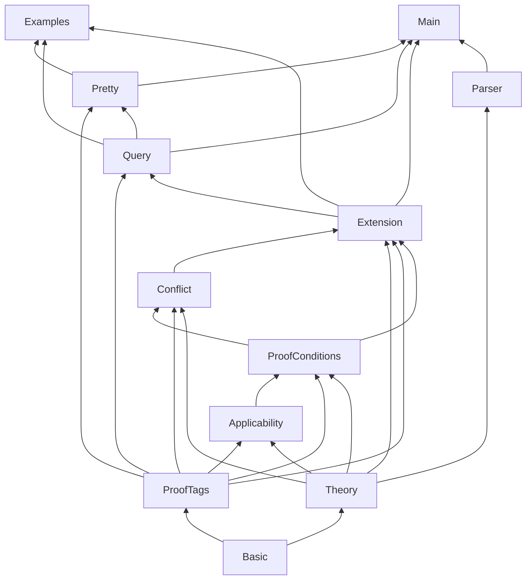

# Architecture

This document describes how the **deontic** reasoner is structured: from `.ddl` input files through proof-theoretic extension computation to CLI and JSON output.

The implementation follows the proof-theoretic account of **defeasible deontic logic** in Governatori (2018), *Defeasible Deontic Logic: An Argumentation-based Approach* (especially §3.1–§3.3 on tagged literals, proof conditions, and superiority).

## High-level flow

```
  .ddl file
      │
      ▼
  Parser.lean          ──►  Theory (facts, rules, superiority)
      │
      ▼
  Extension.lean       ──►  fixed-point Derivation (+∂ / −∂ tags)
      │                      via ProofConditions + Applicability
      ▼
  Conflict.lean        ──►  unresolved obligation deadlocks
      │
      ▼
  ProofConditions      ──►  +∂_⊥ (non-compensable violation)
      │
      ▼
  Query / Pretty       ──►  human status or JSON for tools
```

The CLI entry point is `Main.lean`, which loads a theory, calls `computeExtension`, and renders results.

## Repository layout

| Path | Role |
|------|------|
| `Deontic/Basic.lean` | Atoms, literals (`pos` / `neg`), deontic operators, `OExpr` (compensatory chains `a * b * c`) |
| `Deontic/Theory.lean` | `Rule`, `Theory`, Herbrand base, superiority (`defeats`) |
| `Deontic/Parser.lean` | Tokeniser and parser for `.ddl` → `Theory` |
| `Deontic/ProofTags.lean` | Modalities (`C`, `O`, `P`, `Pw`, `Ps`), `TaggedLit`, `Derivation`, `Extension` |
| `Deontic/Applicability.lean` | Body-applicable / body-p-applicable; compensatory index conditions |
| `Deontic/ProofConditions.lean` | `canDerive_*` for each modality; `canDerive_bot`; `applicableObligationRules` |
| `Deontic/Extension.lean` | Fixed-point loop over the Herbrand base |
| `Deontic/Conflict.lean` | Unresolved `O(a)` vs `O(~a)` conflicts (judge / superiority) |
| `Deontic/Query.lean` | Per-atom normative status (`O`, `F`, `Ps`, `unresolved`, …) |
| `Deontic/Pretty.lean` | Text and JSON rendering |
| `Deontic/Examples.lean` | Embedded theories and `#eval` demos |
| `Main.lean` | `deontic check` / `deontic query` executable |
| `examples/*.ddl` | Sample theories (license contract, TCPC complaint, …) |

Build system: [Lake](https://github.com/leanprover/lean4) (`lakefile.lean`, `lean-toolchain`).

## Core data structures

### Theory

A **defeasible deontic theory** `D = (F, R, ≺)`:

- **Facts** `F`: ground literals that hold in the scenario (e.g. `license`, `commission`).
- **Rules** `R`: labelled rules with strength (`->`, `=>`, `~>`), family (constitutive vs prescriptive `…O`), antecedent, and conclusion (possibly a compensatory chain).
- **Superiority** `≺`: ordered pairs `(winner, loser)` — when two rules conflict, the winner defeats the loser.

### Derivation and extension

Reasoning does not output a single “true” atom set. It builds a **derivation** `P`: a set of **tagged literals**:

- `+∂_□ q` — defeasibly derive literal `q` in modality `□`
- `−∂_□ q` — defeasibly derive the strong negation of `+∂_□ q`

Modalities include constitutive `C`, obligation `O`, and several permission flavours (`Ps`, `Pw`, `P`).

An **extension** bundles:

| Field | Meaning |
|-------|---------|
| `derivation` | Final tagged literal set after fixed point |
| `hasViolation` | `+∂_⊥`: an applicable obligation is unfulfilled in the facts and not compensable |
| `unresolvedConflicts` | Applicable rules support both `O(a)` and `O(~a)` with no `≺` between them |

## Fixed-point engine (`Extension.lean`)

`computeExtension` iterates until no new tags appear:

1. For each atom in the **Herbrand base** (all atoms appearing in facts or rules).
2. For each literal polarity and modality, try to add `+∂` or `−∂` if the corresponding `canDerive_*` predicate holds given the current derivation.
3. Repeat until stable (fuel-bounded).

Proof conditions in `ProofConditions.lean` are **modular**: each `canDerive_O_pos`, `canDerive_C_pos`, etc. implements the paper’s side of the calculus for that tag. They consult:

- current derivation `P`
- rule applicability (`Applicability.lean`)
- superiority when counter-rules must be defeated or discarded

Obligations use **only** strict and defeasible rules (not defeaters `~>`) to establish `+∂_O`; defeaters block or reshape conclusions without positively entailing obligations.

## Applicability and compensatory chains

`Applicability.lean` encodes when a rule’s body is satisfied:

- Plain literals: membership in facts `F` or prior `+∂` / `−∂` tags.
- Deontic literals in the body: corresponding tags in `P`.
- **Compensatory** prescriptive conclusions `c1 * c2 * … * cn`: literal `cj` is only obligating if all earlier `ck` (`k < j`) are already `+∂_O` *and* violated in the facts (the “remedy after breach” pattern in the license example).

## Outcomes the tool surfaces

### Normative status (`Query.lean`)

For each queried atom, the CLI reports a summary status, in priority order:

1. `unresolved` — deadlocked obligation conflict on this atom
2. `O(a)` / `F(a)` — obligation / prohibition
3. `Ps(a)`, factual constitutive, `P(a)`, `Pw(a)`, or `unknown`

### Non-compensable violation (`+∂_⊥`)

`canDerive_bot` is true when some applicable prescriptive rule’s full conclusion chain is obligating in `P`, but at least one conclusion literal is **violated** in the facts (positive atom missing, or negative atom’s positive form present). Example: `publish` without `remove` when `r2`’s compensatory structure applies.

### Unresolved conflicts (judge)

`Conflict.lean` runs **after** the fixed point. For each atom `a`:

- Neither `+∂_O(a)` nor `+∂_O(~a)` is in the derivation.
- There are applicable obligation rules on both sides.
- Some pair `(r, s)` has **no** superiority in either direction.

The reasoner prints `[JUDGE: …]` and suggests adding `r > s` or `s > r`. This is intentional: the engine does not guess the law; a human (or downstream workflow) supplies `≺`.

## Parser and `.ddl` syntax

`Parser.lean` reads line-oriented theories:

```ddl
facts: license, commission, use

r4:  commission  =>O  publish
r2:  =>O  ~publish * remove

superiority: r4 > r2, r2e > r2
```

- Comments: `# …`
- Rule arrows: `->`, `=>`, `~>`, and prescriptive variants `->O`, `=>O`, `~>O`
- Negation: `~atom`
- Compensatory chain: `lit1 * lit2 * …`
- Superiority: `r1 > r2` (comma-separated)

## CLI

```bash
lake build deontic
./.lake/build/bin/deontic check  examples/ex1_license.ddl
./.lake/build/bin/deontic query examples/ex1_license.ddl publish use --json
```

| Command | Purpose |
|---------|---------|
| `check` | Full extension (all tagged literals) + warnings |
| `query` | Per-atom status; optional `--trace`, `--json` |

Flags:

- `--json` — machine-readable output (`hasViolation`, `unresolvedConflicts`, per-atom `status` / `tags`)
- `--trace` — show derived tags behind each query answer

## Module dependency graph



## Design choices

**Lean 4** — The proof conditions are pure functions over finite structures; Lean gives executable semantics now and a path to machine-checked refinements later (e.g. aligning `canDerive_O_pos` with a formal spec).

**Fixed-point, not SAT** — The paper’s proof theory is operationalised directly. There is no external solver; complexity is bounded by Herbrand size and iteration fuel.

**Separation of violation vs deadlock** — `+∂_⊥` means “an obligation you *did* derive is broken in the facts.” Unresolved conflicts mean “you *cannot* derive either side until the judge adds `≺`.”

**JSON-first for integration** — Structured output is aimed at orchestration layers (agents, review UIs, regression tests) that sit above the core reasoner.

## Extension points (planned integration)

- **Theory generation**: LLM or retrieval produces candidate `.ddl` from natural language; the reasoner validates and returns tags, violations, and judge prompts.
- **Superiority curation**: Human or meta-reasoner edits `superiority:` lines in response to `[JUDGE: …]` output.
- **Embeddings / RAG**: Facts and rule bodies link to source spans in statutes or contracts; not yet in this repo.
- **Proof certificates**: Export the derivation `P` and rule instances that fired for explainability.

See the root [README](../README.md) for project motivation and quick start.

LLM workflow prompts (fact extraction, law → DDL) live in [`../prompts/`](../prompts/).
